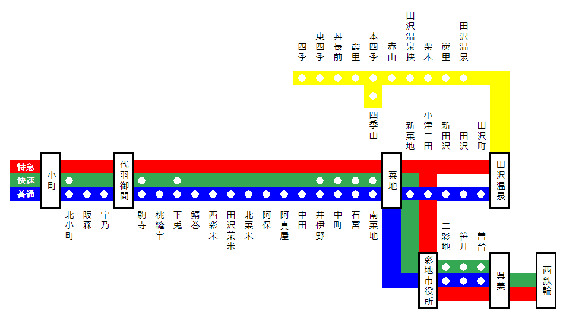

## 田沢電鉄
- 大企業「こまでんグループ」参加
- 一部複線、高架区間あり（未定義）
- 近代的路線
- 乗り入れ
    - 申請性
    - 具体性（未定義？）

## 架空都市
- 伊井県/県庁所在地
    - 市街地のイメージ
        - 青森県青森市
    - 温泉街のイメージ
        - 温泉街は大きい（特急）
        - 観桜客が多い（桜がメジャー）

## 路線
- 田沢線（本線）
    - 小町〜田沢温泉
- 呉彩線（支線）
    - 呉美〜彩池
- 四季線
    - 田沢温泉〜四季
- 四季支線
    - 本四季〜四季山

    
<!--  -->
    

## 車両
- 2000系（近郊型）
- 7000系（特急こまざわ）
- 3000系（急行車両）
- 4000系（通勤車両）
- 1000系（旧型車両）
- 5000系（特急こまざわ）
- 100系（直通特急サンムーン）
- EF58（臨時列車晴天号）
- 3000系
